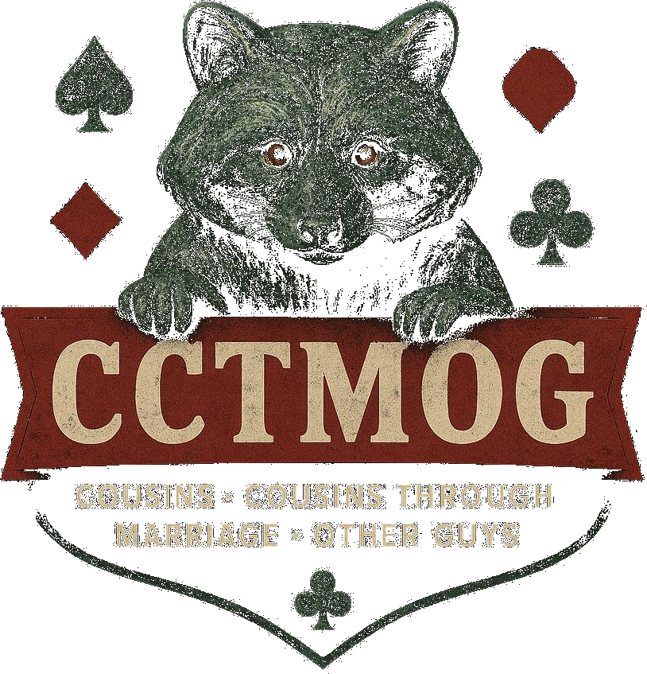

# CCTMOG — Multiplayer Card Games Platform

A modern, real-time multiplayer card game platform built with Rust, featuring WebSocket communication and a beautiful GUI powered by iced 0.13. Currently supports Seven-Twenty-Seven (7–27) with plans for additional poker variants.

## Features

- **Real-time Multiplayer**: WebSocket-based communication for instant gameplay
- **Beautiful GUI**: Native desktop client built with iced framework
- **Multiple Game Support**: Extensible architecture supporting various card games
- **Cross-Platform**: Runs on Windows, macOS, and Linux
- **Server Architecture**: Dedicated game server with persistent game state
- **Modern Rust**: Built with latest Rust features and best practices

## Supported Games

### Seven-Twenty-Seven (7–27)
A unique card game where players aim to get their hand total as close to 7 or 27 as possible without going over.

### Coming Soon
- Texas Hold'em Poker
- Omaha Poker
- Additional poker variants

## Architecture

- **Client** (`client/`): iced-based GUI application
- **Server** (`server/`): WebSocket game server with game logic
- **Protocol** (`protocol/`): Shared message types and game state definitions
- **Cards** (`client/cards/`): SVG card assets for all standard playing cards

## Quick Start

### Prerequisites
- Rust 1.70+ installed ([Install Rust](https://rustup.rs/))
- Git ([Installation instructions below](#git-installation))

### Installation & Running

1. **Clone the repository**
```bash
git clone https://github.com/LaurentiusCanadensis/cctmog.git
cd cctmog
```

2. **Build the project**
```bash
cargo build
```

3. **Start the server**
```bash
cd server
cargo run -p cctmog-server
# Server listens on ws://0.0.0.0:9001/ws
```

4. **Launch client(s)** (in separate terminals)
```bash
cd client
cargo run -p cctmog
```

Run multiple client instances to simulate multiple players!

## Development

### Project Structure
```
cctmog/
├── client/           # GUI client application
│   ├── src/         # Client source code
│   ├── assets/      # Logos and images
│   └── cards/       # SVG card files
├── server/          # Game server
│   └── src/         # Server source code
├── protocol/        # Shared protocol definitions
└── vendor/          # External dependencies
```

### Testing
```bash
cargo test
```

### Code Analysis
```bash
# View project statistics
tokei

# Detailed file breakdown
tokei -f
```

### Git Installation

#### Windows
1. Download from [git-scm.com](https://git-scm.com/download/win)
2. Run the installer with default settings
3. Verify installation: `git --version`

#### macOS
**Option 1: Homebrew (recommended)**
```bash
brew install git
```

**Option 2: Official installer**
1. Download from [git-scm.com](https://git-scm.com/download/mac)
2. Run the installer

**Option 3: Xcode Command Line Tools**
```bash
xcode-select --install
```

#### Linux
**Ubuntu/Debian:**
```bash
sudo apt update
sudo apt install git
```

**Fedora/RHEL/CentOS:**
```bash
sudo dnf install git
# or for older versions:
sudo yum install git
```

**Arch Linux:**
```bash
sudo pacman -S git
```

**Verify installation:**
```bash
git --version
```

## Upcoming Improvements

### Short Term (v1.1)
- [ ] **Enhanced UI/UX**
  - Improved card animations and transitions
  - Better visual feedback for player actions
  - Sound effects and audio cues
  - Customizable themes

- [ ] **Game Features**
  - Spectator mode
  - Game replays and hand history
  - Player statistics tracking
  - Tournament mode

- [ ] **Technical Improvements**
  - Reconnection handling for dropped connections
  - Better error handling and user feedback
  - Performance optimizations
  - Automated testing for game logic

### Medium Term (v1.2)
- [ ] **New Games**
  - Texas Hold'em implementation
  - Omaha poker variant
  - Blackjack

- [ ] **Social Features**
  - Player profiles and avatars
  - Friend lists and private tables
  - Chat system with emotes
  - Player rankings and leaderboards

- [ ] **Infrastructure**
  - Database integration for persistent data
  - User authentication and accounts
  - Game room management
  - Administrative tools

### Long Term (v2.0+)
- [ ] **Advanced Features**
  - Mobile app (using tauri or similar)
  - Web client version
  - AI opponents with different difficulty levels
  - Custom game rules and variants

- [ ] **Deployment & Scaling**
  - Docker containerization
  - Cloud deployment guides
  - Horizontal scaling support
  - Monitoring and analytics

- [ ] **Community**
  - Plugin system for custom games
  - Mod support
  - Community tournaments
  - Open source contributions guide

## Contributing

We welcome contributions! Please see our contribution guidelines for more information.

## License

This project is licensed under the MIT License - see the LICENSE file for details.

## Acknowledgments

- Card graphics from [svg-cards2](https://github.com/htdebeer/svg-cards) project
- Built with the amazing [iced](https://github.com/iced-rs/iced) GUI framework
- Powered by [Rust](https://www.rust-lang.org/) and its incredible ecosystem
